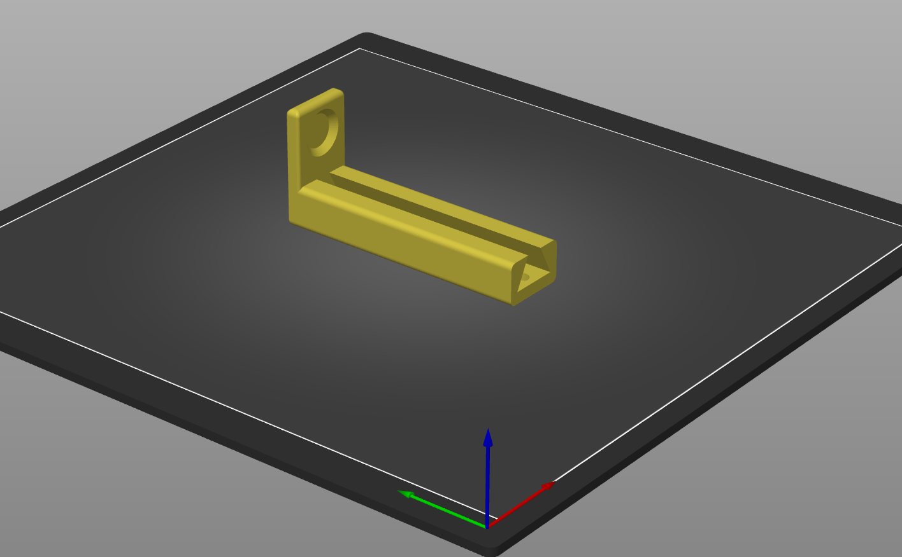
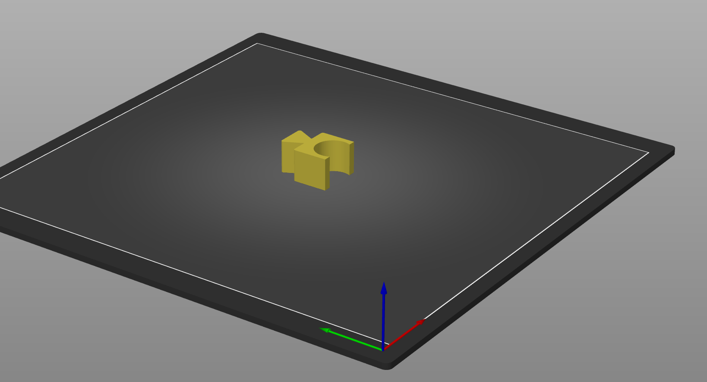

# Blood pricker holder

*Engineering to the Rescue: A 3D-Printed Finger Prick Solution for Diabetic Patients with One Arm or Motor Impairment*

### The context
As engineers, we are passionate about using our skills to solve real-world problems. That's why we were excited to develop a 3D-printed finger prick solution for diabetic patients with one arm.

The question arrived to us from the AZ Sint-Maarten hospital in Mechelen, Belgium. Traditional finger prick devices can be difficult to use for people with one arm or motor impairment. This can lead to frustration and missed tests, which can have serious consequences for blood sugar management. They even require family members to frequently visit for the simple act of checking their blood sugar. 

### The solution
Our solution is a simple, yet effective device that allows diabetic patients with one arm to prick their finger and test their blood sugar with ease.  
The 3D print is tailored to use the [Fast Clix finger prickers from Accu-Chek](https://www.accu-chek.com/).
The device is 3D-printed and completely free to print for everyone, please refer to [Printables](https://www.printables.com/model/903467-blood-pricker-holder).

In addition, some beta patients also reported that it's just convenient to have the blood sampler in a dedicated place. Therefore, we also developed a case for mounting it or for carrying it with you.

We are proud to have developed this solution, which is helping to make diabetes management easier and more accessible for people with one arm. We are committed to using our engineering skills to solve real-world problems and make a positive impact on the lives of others.

*DISCLAIMER: This is not a medical product, but just a hobby project. We do not take any responsibility for any injuries as a consequence of using the holder.*

### How to print
The blood prick holder consists of two components:
 - Holder (Blood-pricker-holder.3mf)
 - Dove (Blood-pricker-dove.3mf)

Our recommended settings to print this model in PLA are using an infill of 15%, and using the print orientations as shown below:

Finally, you can slot the dove into the holder as shown in Blood-pricker-complete.3mf.

### Contact
If you have any questions, suggestions, or remarks, please feel free to contact the iMagineLab developers:
* Satish Singh - satish.singh4545@outlook.com
* Thomas Janssen - r8.thomasjanssen@gmail.com

### In collaboration with

